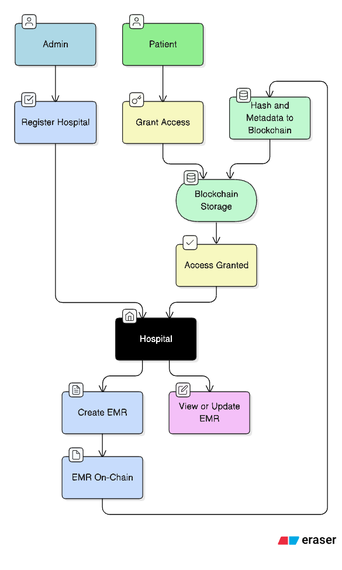

# 🏥 Medisa — Recording EMR On-Chain

Medisa is a blockchain-based platform designed to securely **record, manage, and share Electronic Medical Records (EMR)** on-chain. By leveraging blockchain technology, Medisa ensures **data integrity, transparency, and patient-controlled access** to sensitive health records.

---

## 🚀 Goals

- ✅ Ensure **immutability** of medical records using blockchain.
- ✅ Provide **patient sovereignty** over their health data.
- ✅ Enable **secure delegation** of EMR access to healthcare providers.
- ✅ Support **auditability** and compliance with health data standards.

---

## 🛠️ Features

- **On-Chain EMR Recording** — Store essential health record metadata on blockchain while keeping sensitive data encrypted off-chain.
- **Patient-Controlled Access** — Patients grant/revoke access to doctors, hospitals, or family members.
- **Delegated Permissions** — Family members can receive delegated rights to view or manage EMR.
- **Transparency & Traceability** — Every access/update event is traceable and verifiable.

---

## 📦 Installation

Clone the repository:

```bash
git clone https://github.com/your-org/medisa.git
cd medisa
```

Install dependencies and run test:

```bash
cd frontend
bun install
bun test

```

---

## 🔑 Environment Variables

Create a `.env` file in the project root:

```bash
NEXT_PUBLIC_RPC_URL="https://your-rpc-endpoint"
NEXT_PUBLIC_PRIVATE_KEY="0x...."
NEXT_PUBLIC_CONTRACT_ADDRESS="......"
```

---

## 🔄 Flow Explanation



### 1. Admin Registers Hospital

1. The Admin entity registers a hospital in the Medisa system.
2. This ensures only authorized hospitals can create EMRs.

### 2. Hospital Creates EMR

1. The registered Hospital creates an EMR for a patient.
2. EMR metadata (hash, pointers, ownership) is stored on-chain.
3. Encrypted medical files are stored off-chain.

### 3. Patient Grants Access

1. The Patient has full control over their EMR.
2. They can grant/revoke access for hospitals, doctors, or family members.
3. With access granted, the hospital can retrieve and decrypt the EMR.

---
